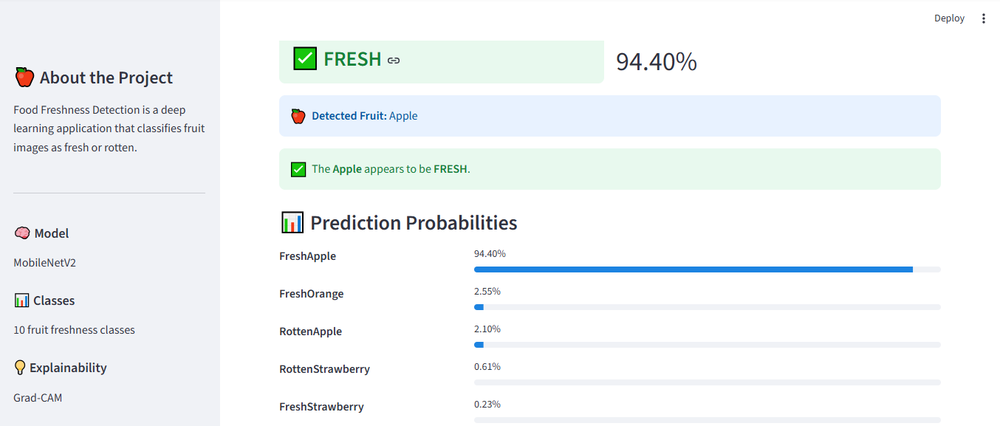
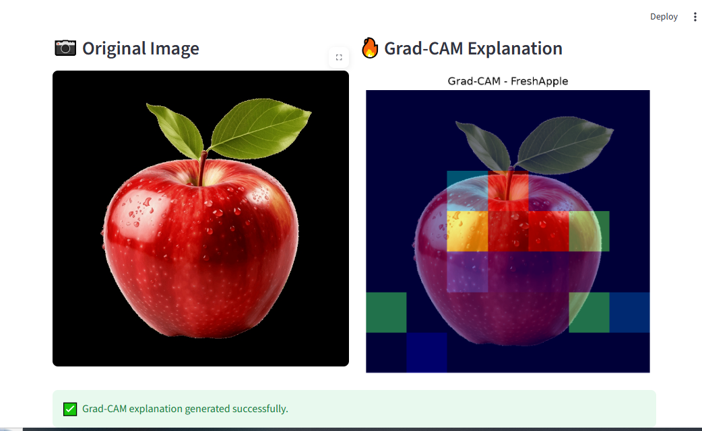

# 🍎 Food Freshness Detection Using Deep Learning and Explainable AI

## 📌 Project Overview

Food Freshness Detection is a deep learning-based computer vision project that classifies fruit images as fresh or rotten.

The project uses **MobileNetV2** for image classification and **Grad-CAM** for Explainable AI.

A Streamlit web application provides an interactive interface where users can upload a fruit image and receive a prediction with confidence scores, probability distribution, and a visual Grad-CAM explanation.

---

## 🎯 Objectives

- Detect whether a fruit is fresh or rotten.
- Identify the type of fruit.
- Provide prediction confidence.
- Display probability scores for all classes.
- Provide an explainable AI visualization using Grad-CAM.
- Develop an easy-to-use web interface using Streamlit.

---

## 🧠 Model

The project uses **MobileNetV2**, a lightweight convolutional neural network suitable for image classification.

### Input Size

224 × 224 pixels

### Number of Classes

10

### Supported Fruits

- Apple
- Banana
- Mango
- Orange
- Strawberry

Each fruit has two freshness categories:

- Fresh
- Rotten

---

## 📊 Model Performance

The model achieved approximately **97.2% validation accuracy** during evaluation.

Performance on external images may vary depending on image quality, lighting, background, camera angle, and differences between the training dataset and real-world images.

---

## 💡 Explainable AI

The project uses **Grad-CAM (Gradient-weighted Class Activation Mapping)** to provide a visual explanation of the model's prediction.

The heatmap highlights image regions that contributed to the predicted class.

---

## 🔄 Project Workflow

1. Upload a fruit image.
2. Resize the image to 224 × 224 pixels.
3. Pass the image to the MobileNetV2 model.
4. Generate class probabilities.
5. Identify the predicted fruit and freshness status.
6. Display the confidence score.
7. Generate a Grad-CAM explanation.

---

## 🖥️ Application Screenshots

### Main Interface


### Prediction Result



### Grad-CAM Explanation



### Project Workflow


---

## 🛠️ Technologies Used

- Python
- TensorFlow
- Keras
- MobileNetV2
- Streamlit
- NumPy
- Pillow
- Matplotlib
- Grad-CAM

---

## 📁 Project Structure

```text
food-freshness-detection/
│
├── app.py
├── app_backup.py
├── best_fruit_freshness_model.keras
├── Food_Freshness_Detection_Final (1).ipynb
├── gradcam_test.py
├── requirements.txt
├── README.md
├── .gitignore
└── screenshots/
    ├── main-interface.png
    ├── prediction.png
    ├── gradcam.png
    └── workflow.png
```

---

## ▶️ How to Run

### 1. Clone the repository

```bash
git clone https://github.com/gopikasuresh76/food-freshness-detection.git
cd food-freshness-detection
```

### 2. Create a virtual environment

```bash
python -m venv venv
```

### 3. Activate the environment on Windows

```powershell
.\venv\Scripts\Activate.ps1
```

### 4. Install the required packages

```bash
pip install -r requirements.txt
```

### 5. Run the Streamlit application

```bash
streamlit run app.py
```

The application will open in your browser.

---

## ⚠️ Limitations

The model was trained on a specific fruit image dataset. Therefore, prediction performance may vary for images captured in different environments.

Factors such as lighting, background, camera angle, image quality, and differences in image sources can affect predictions.

The system provides an AI-based estimation and should not replace human inspection.

---

## 🚀 Future Improvements

- Support for additional fruits and vegetables.
- Larger and more diverse datasets.
- Improved real-world image generalization.
- Cloud deployment.
- Mobile application integration.
- Additional Explainable AI techniques.

---

## 📌 Project Type

Academic Deep Learning / Computer Vision Project